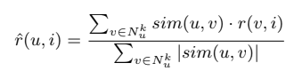

# RecommendationSystem
Sistema recomendador que implementa filtrado colaborativo basado en usuario.


## Recommender

Se trata de la clase principal, que contiene los siguientes atributos: 

* **numOfNeighbors**: Número de vecinos a tener en cuenta para calcular predicciones.
* **metricName**: Nombre de la métrica de similitud que se está usando. (`pearson`, `cosine`, `euclidean`)
* **predictorName**: Nombre del método de predicción que se está usando (`userBased/collaborativeFiltering/simple`, `userBased/collaborativeFiltering/meanDiff`)
* **utilityMatrix**: Matriz de utilidad cargada (sin predicciones) donde cada valoración es un número y cada valoración vacía es `undefined`.
* **similarityMatrix**: Matriz de similitudes (usuarios x usuarios)

```JavaScript
const matrix = `1 2 -\n4 5 6`;
const recommender = new Recommender();
recommender.setUtilityMatrix(matrix);
```

Para cargar la matriz se utiliza el método `setUtilityMatrix`, que recibe la matriz como una `string`en la que las valoraciones están separadas por espacios, las valoraciones vacías se representan con `-` y las filas se separan por saltos de línea (`\n`)

Por defecto, la métrica de similitud a utilizar es el coeficiente de correlación de Pearson, el número de vecinos a considerar es tres (3) y el método de predicción tiene en cuenta la diferencia con la media.


### `setUtilityMatrix(matrix: float[][])`
Recibe la matriz como una `string` en la que las valoraciones están separadas por espacios, las valoraciones vacías se representan con `-` y las filas se separan por saltos de línea (`\n`) y la carga en el atributo `utilityMatrix`convirtiéndola en una matriz de `float` donde cada `-` es sustituido por un `undefined`

Ejemplo:

```
0 0 2 3 4 4 5 3 0 0 
3 - 5 4 - - 1 5 - 0 
5 - 2 4 3 - 0 - - 4 
0 3 4 2 4 4 - 3 0 1 
- - 5 4 5 4 3 4 2 5 
```
Este método desencadena también el cálculo de la matriz de similitudes, por lo que se actualiza dicho atributo.


### `setSimilarityMatrix(matrix: string)`
Si se le pasa una matriz, se define como la nueva matriz de similitud, si no, se calcula a partir de la matriz de utilidad cargada y se guarda en el atributo `similarityMatrix`.


### `getEmptyItems()`
Devuelve un array de arrays de la forma [u, i] que representan las posiciones de las valoraciones que están vacías en la matriz de utilidad.

### `calculateSimilarityMatrix()`
Calcula y devuelve la matriz de similitud a partir de la matriz de utilidad cargada usando para ello la métrica activa actualmente.

### `getUserMean(u)`
Devuelve la media de calificaciones del usuario u teniendo en cuenta todas las valoraciones que el usuario haya realizado.

Ejemplo:

```
1 3 0 2 -  // Calificaciones de u
getUserMean(u)  // Media de u: (1 + 3 + 0 + 2) / 4 = 1.5
```

### getNearestNeighbors(u, neighborsNum, i)
Devuelve un vector de objetos con la forma `{index, sim}`, que representa, como máximo, los `negihborsNum` vecinos más cercanos al usuario `u` que también han calificado el ítem `i`.

* `index`: índice del vecino cercano
* `sim`: similitud del vecino con el usuario u

***Nota** no siempre hay neighborsNum que también han calificado al ítem i*


## Similarity calculators
Se trata de un objeto que almacena las diferentes funciones para calcular métricas de similitud. Consta de:

* `pearson(u, v)`: Calcula el coeficiente de correlación de Pearson entre los dos usuarios.
* `cosine(u, v)`: Calcula la distancia coseno entre los usuarios u y v. 
* `euclidean(u, v)`: Calcula la distancia euclídea entre los usuarios u y v.

## Collaborative Filtering - Métodos de predicción
Se trata de un objeto que almacena los métodos de filtrado colaborativo, en este caso almacena un objeto que a su vez almacena los métodos de filtrado colabrativo basados en usuario `userBased`.

Estos métodos son:

* `simple(u, i)`: Aplica la fórmula de predicción sin tener en cuenta la media 

+ `meanDiff(u, i)`: Aplica la fórmula de predicción teniendo en cuenta la media de calificaciones de los usuarios 